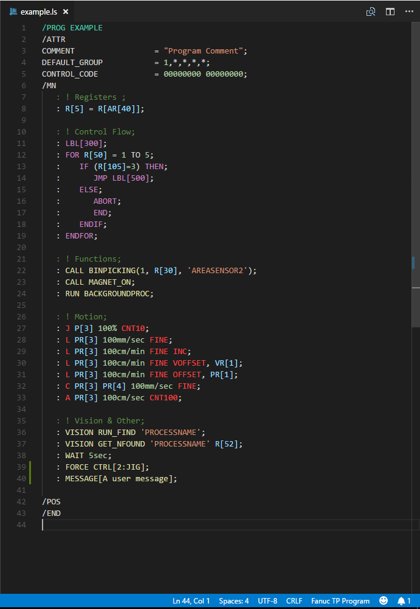

Fanuc TP Language Syntax Highlighter
=============

A syntax highlighter for Fanuc TP Programs in VSCode.
Uses TextMate language format so usage in other editors should be possible.

## Installation

Place the entire 'fanuctp' folder in `<Your VSCode Install Path>\resources\app\extensions`

File extensions recognized:
- .ls

## Autocompletion
This shows the supported autocompletions:

## Output
The highlights that are currently supported:

